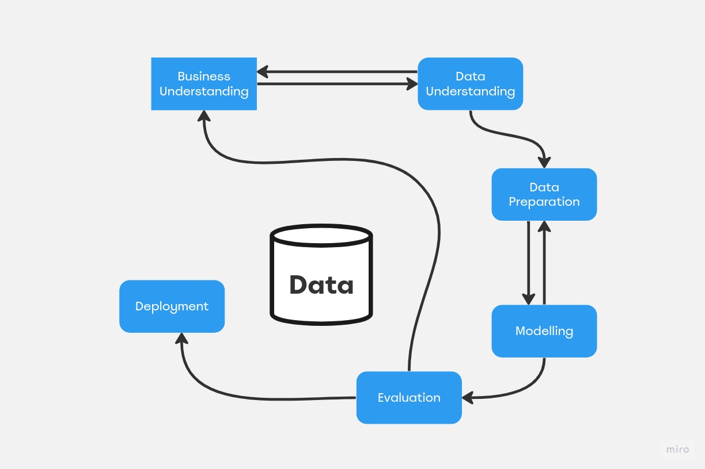
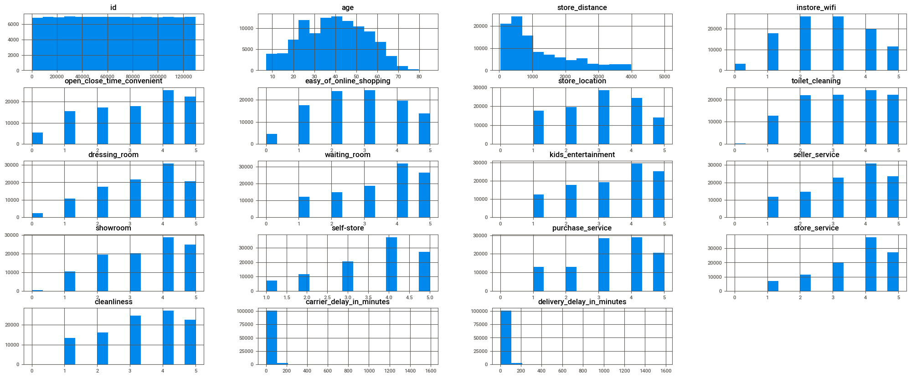
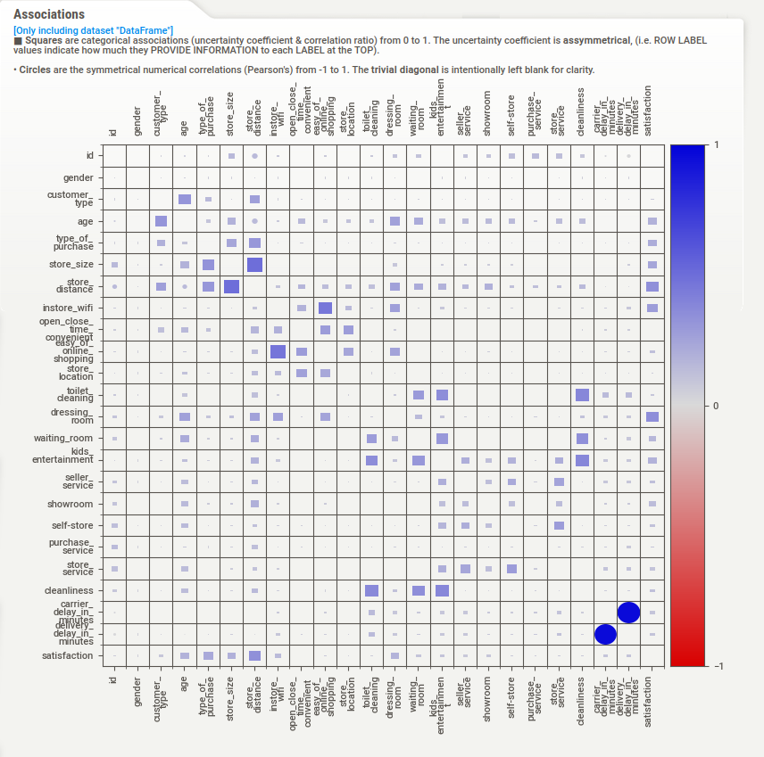

 <h1 align="center"> "InStyle Net Promoter Score Data Science Project" </h1>

# Welcome to my portfolio project for the Community DS data competition: "InStyle Net Promoter Score"

# Business Problem Description

InStyle is one of the largest clothing stores in the United States facing customer experience issues.

The major challenge in scaling a store's revenue is maintaining product quality and customer satisfaction rates.

As the company reaches more customers, internal sales processes that start with product conception, go through marketing promotion, and reach financial payment systems start encountering issues.

The product team struggles to determine the majority of customer needs. The marketing team faces challenges in identifying the ideal customer, and the development team grapples with high volumes of website and app traffic, causing system crashes and rendering the site inoperable for hours. This leads to numerous complaints in customer service, overseen by the customer experience team.

Hence, measuring customer satisfaction is extremely important for the company to maintain a strong market reputation.

An interdisciplinary team called the "War Room," composed of professionals from Product, Marketing, Design, Data, and Development, was formed to ensure an excellent customer shopping experience and a high satisfaction rate, even with rapid sales volume growth.

One of the War Room's initial emergency actions was to provide personalized customer service. However, the initial challenge was identifying which customers would have a "Satisfied" or "Neutral/Unsatisfied" satisfaction level so that the team could contact only the "Neutral/Unsatisfied" customers.

The Data Scientists in the War Room were tasked with training an algorithm to classify customers from a spreadsheet as "Satisfied" or "Neutral/Unsatisfied," predicting which customers would be Unsatisfied, and therefore acting quickly to understand the reason for dissatisfaction and reverse the customer's situation.

**Source:** [ Kaggle ](https://www.kaggle.com/competitions/instyle-nps/overview)

## 2.0 Preliminary Planning

* In this competition, Community DS students were divided into squads of 4 and/or 5 participants each. In total, there were 23 squads and over 100 participants.
* My squad had the following members:

* Bernardo Puppim
* Ricardo Fernandes
* Edilson Santos
* Igor Neri

### The CRISP-DM method was used as the basis for developing this project.

### 2.1 Tools, IDEs, and Libraries

* Python 3.09
* Visual Studio Code
* Jupyter Notebook
* Deepnote
* Libraries: Seaborn, Sweetviz, Pandas, Numpy, Inflection, Optuna, SKLearn Models and Metrics, Label Encoder, LightGBM, XGBoost, CatBoost, Random Forest, Decision Tree, and Voting Classifiers.

### 2.2 Final Product

* A classification solution that provides the best possible prediction algorithm to classify customers from a spreadsheet as "Satisfied" or "Neutral/Unsatisfied," predicting which customers would be Unsatisfied.

## 3.0 Data

##### These data are public and were downloaded from the [Kaggle](https://www.kaggle.com/competitions/cdshackdays4).

### 3.1 Source Attributes

| **Attributes**              |  **Type**  |  **Description**                                                   |
| ----------------------------|------------|--------------------------------------------------------------------|
|Id                           |  int64     | Identification costumer number                                     |
| Gender                      |  object    | Customer's gender                                                  |
| Age                         |  object    | Customer's age                                                     |
| Type of Purchase            |  int64     | The type of purchase                                               |
| Store size                  |  object    | The size of the store                                              |
| Store distance              |  object    |  Distance to the city center                                       |
| In-Store wifi               |  int64     | Satisfaction level with the store's Wi-Fi                          |
| Open/Close time convenience |  int64     | Satisfaction level with the store's opening and closing hours      |
| Ease of online shopping     |  int64     | Satisfaction level with online shopping                            |
| Store location              |  int64     | Satisfaction level with store accessibility                        |
| Toilet cleaning             |  int64     | Cleanliness level of the restrooms                                 |
| Dressing room               |  int64     | Satisfaction level with the fitting room                           |
| Waiting room                |  int64     | Satisfaction level with the waiting area inside the store          |
| Kids entertainment          |  int64     | Satisfaction level with the kids' play area                        |
| Seller service              |  int64     | Satisfaction level with the service provided by t    he salespeople|
| Showroom                    |  int64     | Satisfaction level with the arrangement of clothes inside the store|
| Self-Store                  |  int64     | Satisfaction level with the store's locker service                 |
| Purchase service            |  int64     | Satisfaction level with the payment service                        |
| In-Flight Service           |  int64     | Store service                                                      | 
| Cleanliness                 |  int64     | Satisfaction level with the cleanliness of the store               |
| Carrier delay in minutes    |  int64     | Delay time for the product at the carrier's departure              |
| Delivery delay in minutes   |  float64   | Delay time in product delivery to the customer's house             |
| Satisfaction                |  object    | Target attribute                                                   |

### 3.2 Created Attributes

First of all, we separated the customer classification features into the variable called 'survey features,' which contains the following columns:

survey_features = ['instore_wifi', 'open_close_time_convenient', 'easy_of_online_shopping', 'store_location', 
                   'toilet_cleaning', 'dressing_room', 'waiting_room', 'kids_entertainment', 'seller_service', 'showroom', 'self-store', 
                   'purchase_service', 'store_service', 'cleanliness']

- average_rating: This attribute calculates the mean (average) of the survey features for each row across the columns.
- max_rating: This attribute calculates the maximum value of the survey features across the columns for each row.
- min_rating: This attribute calculates the minimum value of the survey features across the columns for each row.
- var_rating: This attribute calculates the variance of the survey features across the columns for each row.
- count_positive and count_negative are calculated based on the number of survey features that are greater than 3 and less than or equal to 3, respectively. These values count the number of positive and negative ratings for each row in the DataFrame.

## Visualization of Numerical Attributes in Bar Graph

## Visualization of Numerical and Categorical Attributes Correlations using Sweetviz

## 4.0 Data Preprocessing

During this stage, we prepared the data for the initial steps of the Machine Learning modeling process.

The following original columns were transformed using Label Encoder:
- 'gender'
- 'customer_type'
- 'type_of_purchase'
- 'store_size'

## 5.0 Machine Learning Modeling

In the process of selecting Machine Learning models, we conducted tests and training using six different classifiers: XGBoost, Random Forest, CatBoost, and LGBM Classifier.

For the classification algorithms, we used the Precision Score (Micro) as the evaluation metric.

## Performance

## 6.0 Ensemble Learning

## Ensemble Learning in This Project

In this project, we leverage ensemble learning techniques to enhance the predictive power of our machine learning models. Ensemble learning involves combining the outputs of multiple base models (also known as weak learners) to create a more accurate and robust predictive model.

### Why Ensemble Learning?

The concept behind ensemble learning is simple yet powerful: by aggregating the predictions or decisions of multiple models, we can often achieve superior results compared to relying on a single model. This approach is particularly effective when dealing with complex datasets and challenging prediction tasks.

### Voting and Averaging

Ensemble learning can operate in different ways, including voting for classification problems and averaging for regression problems. Common methods for combining model predictions include:
- **Majority Voting**: In classification tasks, we select the class that receives the majority of votes from individual models.
- **Weighted Voting**: Assigning different weights to the predictions of individual models to influence the final decision.
- **Mean Averaging**: In regression tasks, we calculate the mean of predictions from multiple models.

By incorporating ensemble learning techniques into our project, we aim to improve the accuracy and robustness of our machine learning models, ultimately delivering more reliable results.

## Final Performance:

# 0.9660747798469757

## 7.0 Conclusion

## Leaderboard

